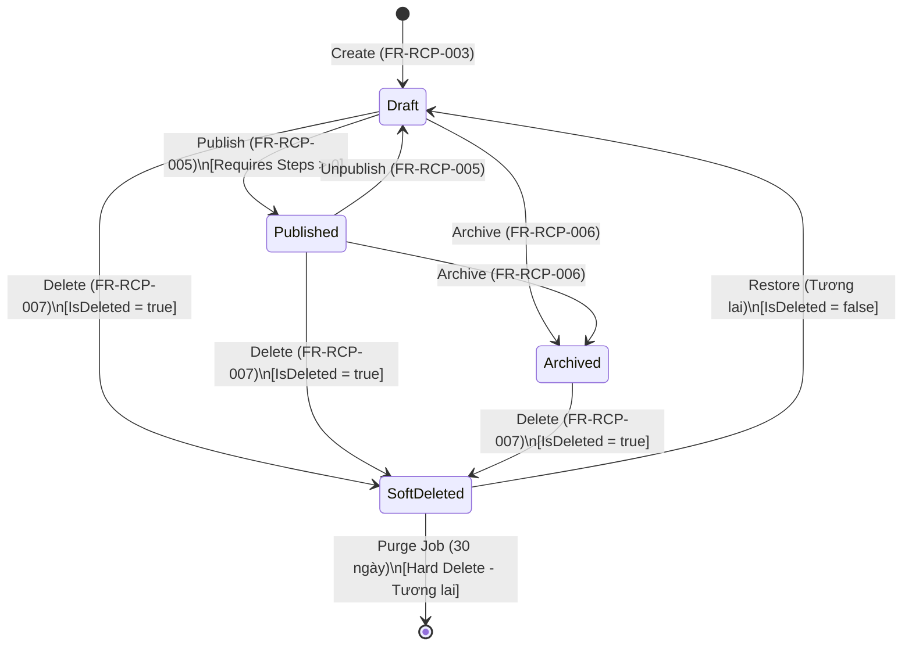

# KẾ HOẠCH TRIỂN KHAI CHI TIẾT TUẦN 3–4
**Chức năng:** Recipe Lifecycle — FR-RCP-005 (Publish/Unpublish), FR-RCP-006 (Archive), FR-RCP-007 (Soft Delete)  
**Người thực hiện:** Nguyễn Thành Minh (MSSV: 2312691)  
**Tài liệu tham chiếu:** `SRS_Culinary_Blog_v1.0.0.md`, `SPEC.md`, `Ke_Hoach_Trien_Khai_Cua_Minh.md`  
**Ngày soạn:** 30/09/2026

---

## ⚠️ RÀ SOÁT MÂU THUẪN GIỮA SRS VÀ SPEC.MD (TRƯỚC KHI LẬP KẾ HOẠCH)

Trước khi bắt tay triển khai, tôi đã rà soát lại toàn bộ 11 mâu thuẫn trong SPEC.md và đối chiếu với SRS + Kế hoạch cá nhân. Dưới đây là các điểm **ảnh hưởng trực tiếp** đến công việc Tuần 3–4:

### Bảng tổng hợp mâu thuẫn ảnh hưởng

| STT | Mâu thuẫn SPEC.md | Vị trí trong SRS | Ảnh hưởng đến FR nào | Giải pháp áp dụng |
|:---:|:---|:---|:---|:---|
| 1 | **Mâu thuẫn 1:** Hard Delete vs Soft Delete | SRS dòng 684–686: ghi "Hard Delete vật lý", `Remove()`, cascade delete, xóa ảnh MinIO | **FR-RCP-007** | ✅ **Áp dụng Soft Delete** (`IsDeleted = true`). Không gọi `Remove()`. Không xóa ảnh MinIO. Giữ nguyên entity con. |
| 2 | **Mâu thuẫn 2:** Cache Invalidation Strategy | SRS không rõ ràng về cách invalidate | **FR-RCP-005, 006, 007** | ✅ Sử dụng Redis Output Cache + `EvictByTagAsync("recipes")` sau mỗi thao tác thay đổi trạng thái. |
| 3 | **Mâu thuẫn 6:** HTTP 400 vs 422 cho business rule | SRS Phụ lục B (dòng 1316): `RECIPE_PUBLISH_INCOMPLETE` trả về HTTP 400 | **FR-RCP-005** | ✅ Thống nhất: Business rule violation → **HTTP 422**. `DomainException` → Middleware map sang 422. |
| 4 | **Mâu thuẫn 8:** Xóa Category chứa Recipe | SRS không rõ tương tác soft-deleted recipe vs category | **FR-RCP-007** | ✅ Recipe có `IsDeleted = true` KHÔNG chặn việc xóa Category (chỉ kiểm tra `IsDeleted == false`). |

### Các điểm SRS đã đồng nhất (không cần sửa)

- ✅ `Ke_Hoach_Trien_Khai_Cua_Minh.md` mục 8 (FR-RCP-007) đã ghi đúng "Soft Delete" theo SPEC.md.
- ✅ HTTP Status Codes: 403 (Forbidden), 404 (Not Found), 422 (Business Rule) đã đồng nhất.
- ✅ Endpoint design: `PATCH /publish`, `PATCH /unpublish`, `PATCH /archive`, `DELETE /recipes/{id}` đã khớp với SRS Chapter 8.3.

> **Quy tắc:** Khi SRS và SPEC.md mâu thuẫn → **SPEC.md là nguồn chính xác** (SPEC.md ra đời sau để giải quyết mâu thuẫn trong SRS).

---

## 1. MỤC TIÊU TRIỂN KHAI TUẦN 3–4

Xây dựng hoàn chỉnh **4 API Endpoints** quản lý vòng đời (Lifecycle) cho Module Recipe:

1. **FR-RCP-005a**: `PATCH /api/v1/recipes/{id}/publish` — Xuất bản công thức
2. **FR-RCP-005b**: `PATCH /api/v1/recipes/{id}/unpublish` — Hủy xuất bản công thức
3. **FR-RCP-006**: `PATCH /api/v1/recipes/{id}/archive` — Lưu trữ công thức
4. **FR-RCP-007**: `DELETE /api/v1/recipes/{id}` — Xóa công thức (Soft Delete)

### Tình trạng Domain Layer (đã sẵn sàng)

Tất cả các domain methods cần thiết **đã được triển khai** ở Tuần 1:

| Domain Method | Vị trí | Trạng thái |
|:---|:---|:---:|
| `recipe.Publish()` | `Recipe.cs:135` — Kiểm tra `Steps.Count > 0`, gán `Status = Published`, `PublishedAt = UtcNow` | ✅ Sẵn sàng |
| `recipe.Unpublish()` | `Recipe.cs:151` — Gán `Status = Draft`, `UpdatedAt = UtcNow` | ✅ Sẵn sàng |
| `recipe.Archive()` | `Recipe.cs:157` — Gán `Status = Archived`, `UpdatedAt = UtcNow` | ✅ Sẵn sàng |
| `recipe.SoftDelete()` | `BaseEntity.cs:11` — Gán `IsDeleted = true`, `UpdatedAt = UtcNow` | ✅ Sẵn sàng |
| `recipe.Restore()` | `BaseEntity.cs:18` — Gán `IsDeleted = false`, `UpdatedAt = UtcNow` | ✅ Sẵn sàng |

> **Kết luận:** Tuần 3–4 chỉ cần triển khai ở tầng **Application** (MediatR Commands/Handlers) và **Presentation** (Endpoints), không cần thay đổi Domain.

### Phụ thuộc trước (Dependencies)

- ✅ **Tuần 1 (Đã xong):** Domain Entities & EF Configurations
- ✅ **Tuần 2–3 (Đã xong):** Core Recipe Operations (FR-RCP-001 → 004), Infrastructure (Repository, UoW, Exceptions, Redis Output Cache)
- ⏳ **FR-AUTH (Người A):** Cần JWT Authentication + Role check. Nếu chưa xong → tiếp tục mock `ICurrentUser`.
- ⏳ **FR-RCP-009/010 (Người D):** Cần chức năng thêm Steps/Ingredients để test Publish happy path. Nếu chưa xong → seed dữ liệu test qua `Recipe.Create(...)` + `recipe.AddStep(...)`.

---

## 2. PHÂN TÍCH CÁCH TRIỂN KHAI

### 2.1. Mô hình Command cho Lifecycle Operations: Riêng lẻ vs Chung

#### Cách 1: Mỗi thao tác một Command riêng (Khuyến nghị ✅)

Tạo các Command/Handler **tách biệt** cho từng hành vi:
- `PublishRecipeCommand` + `PublishRecipeCommandHandler`
- `UnpublishRecipeCommand` + `UnpublishRecipeCommandHandler`
- `ArchiveRecipeCommand` + `ArchiveRecipeCommandHandler`
- `DeleteRecipeCommand` + `DeleteRecipeCommandHandler`

```
Client → PATCH /publish → MediatR.Send(PublishRecipeCommand) → Handler → recipe.Publish() → SaveChanges → Invalidate Cache
Client → DELETE /{id}  → MediatR.Send(DeleteRecipeCommand)  → Handler → recipe.SoftDelete() → SaveChanges → Invalidate Cache
```

**Ưu điểm:**
- **Đúng nguyên tắc SRP:** Mỗi Handler chỉ xử lý đúng 1 hành vi → dễ hiểu, dễ test, dễ debug.
- **Linh hoạt mở rộng:** Nếu sau này cần thêm side-effects riêng (ví dụ: Publish → gửi email thông báo; Delete → enqueue cleanup job), chỉ cần sửa 1 Handler mà không ảnh hưởng những cái khác.
- **Tuân thủ CQRS:** Mỗi intent (ý định) của người dùng → 1 Command riêng biệt.
- **Test isolation:** Có thể mock/test từng kịch bản một cách hoàn toàn độc lập.

**Nhược điểm:**
- Nhiều file hơn (4 Command + 4 Handler = 8 file).
- Logic phân quyền và cache invalidation bị lặp lại giữa các Handler.

**Ảnh hưởng lâu dài:**
- Khi team mở rộng, dev mới dễ dàng hiểu và làm việc với 1 Handler cụ thể mà không cần đọc toàn bộ switch/case logic.
- Dễ dàng bổ sung Event-driven side-effects (Domain Events) cho từng lifecycle action.

#### Cách 2: Một Command chung `ChangeRecipeStatusCommand` (KHÔNG khuyến nghị ❌)

Gom tất cả thao tác vào 1 Command duy nhất kèm parameter `TargetStatus`:
```csharp
record ChangeRecipeStatusCommand(Guid Id, string Action); // "publish" | "unpublish" | "archive" | "delete"
```

**Ưu điểm:**
- Chỉ 1 file Command + 1 file Handler → ít file hơn.
- Logic phân quyền chỉ viết 1 lần.

**Nhược điểm:**
- **Vi phạm SRP:** 1 Handler xử lý 4 hành vi khác nhau → nặng nề, khó bảo trì.
- **Switch/case phình to:** Khi thêm hành vi mới (ví dụ: "schedule publish", "feature recipe") phải sửa cùng 1 file → merge conflict cao.
- **Khó test riêng biệt:** Test case cho Publish phải share test context với Delete.
- **Khác biệt về Response:** Publish/Unpublish/Archive trả `200 OK + RecipeDto`, Delete trả `204 No Content` → khó xử lý trong cùng 1 Handler.
- **Khác biệt về Business Rule:** Chỉ Publish cần kiểm tra `Steps.Count > 0`, các action khác thì không.

**Ảnh hưởng lâu dài:**
- God Handler — 1 file béo phì chứa mọi logic lifecycle → anti-pattern trong Clean Architecture.
- Khó áp dụng MediatR Pipeline Behaviors có điều kiện (ví dụ: chỉ muốn log khi Publish nhưng không log khi Archive).

> **Quyết định:** Chọn **Cách 1 — Command riêng biệt** vì phù hợp với kiến trúc CQRS đã cam kết, dễ bảo trì và mở rộng trong dự án nhóm 4 người.

---

### 2.2. Xử lý Logic Phân quyền: Tập trung vs Phân tán

#### Cách A: Trích xuất Helper Method chung (Khuyến nghị ✅)

Tạo một **Private Static Helper Method** hoặc một **Extension Method** dùng chung cho toàn bộ Lifecycle Handlers:

```csharp
// Trong mỗi Handler, gọi:
var recipe = await EnsureRecipeOwnership(unitOfWork, recipeId, currentUser, ct);

// Helper method kiểm tra 3 điều kiện:
// 1. Recipe tồn tại (không null, không IsDeleted) → 404 NotFoundException
// 2. Người dùng là Owner (AuthorId == currentUserId) hoặc Admin → 403 ForbiddenException
// 3. Trả về entity Recipe sẵn sàng thao tác
```

**Ưu điểm:**
- Logic phân quyền viết 1 lần, gọi lại trong 4 Handlers → **tuân thủ DRY**.
- Vẫn giữ được sự tách biệt của từng Handler (SRP).
- Dễ test: mock helper method hoặc test trực tiếp.

**Nhược điểm:**
- Cần nơi đặt helper method (Extension method hoặc Base class).

#### Cách B: Copy-paste logic check trong mỗi Handler (KHÔNG khuyến nghị ❌)

**Ưu điểm:** Nhanh.
**Nhược điểm:** Vi phạm DRY nghiêm trọng. Khi sửa logic phân quyền phải sửa ở 4+ nơi.

#### Cách C: Dùng ASP.NET IAuthorizationService (Cách tối ưu dài hạn, chưa áp dụng tuần này)

**Lý do chưa áp dụng:** FR-AUTH (Người A) chưa hoàn thiện hạ tầng Resource-Based Authorization. Sẽ refactor sang cách này ở giai đoạn Hardening (Tuần 6–7).

> **Quyết định:** Chọn **Cách A** — Trích xuất helper method `RecipeAuthorizationHelper` làm static class trong `Application/Common/Helpers/`. Giữ DRY mà không cần phụ thuộc vào hạ tầng ASP.NET Authorization chưa sẵn sàng.

---

### 2.3. Cache Invalidation: Khi nào và cách nào

#### Cách I: Invalidate tại Handler (Khuyến nghị ✅)

Mỗi Lifecycle Handler sau khi `SaveChangesAsync()` thành công sẽ gọi trực tiếp `IOutputCacheStore.EvictByTagAsync(...)`:

```csharp
await _cacheStore.EvictByTagAsync("recipes", ct);
```

**Ưu điểm:**
- Đơn giản, trực tiếp, dễ hiểu.
- Đảm bảo cache luôn được xóa sau khi dữ liệu thay đổi.
- Phù hợp với mô hình hiện tại (đã dùng ở FR-RCP-003, FR-RCP-004).

**Nhược điểm:**
- Logic invalidation bị lặp ở mỗi Handler.

#### Cách II: Invalidate qua MediatR Pipeline Behavior (Phức tạp, chưa cần thiết)

Tạo `CacheInvalidationBehavior<TRequest, TResponse>` tự động detect Command nào cần invalidate cache.

**Ưu điểm:** Tách biệt concerns, AOP clean.
**Nhược điểm:** Quá phức tạp cho 4 endpoints đơn giản. Over-engineering cho scope hiện tại.

#### Cách III: Invalidate qua Domain Events (Dài hạn)

Domain Entity publish `RecipeStatusChangedEvent` → Handler lắng nghe → Invalidate cache.

**Nhược điểm:** Cần hạ tầng Domain Events (chưa có). Sẽ xem xét ở Tuần 6–7 (Hardening).

> **Quyết định:** Chọn **Cách I** — Invalidate trực tiếp tại Handler. Giữ sự nhất quán với codebase hiện tại (FR-RCP-003, FR-RCP-004 đã làm tương tự).

---

### 2.4. Response Strategy: Trả về DTO hay chỉ trả Status Code

#### Phân tích theo từng Endpoint:

| Endpoint | SRS yêu cầu | Lý do |
|:---|:---|:---|
| `PATCH /publish` | `200 OK` + `RecipeDto` | Client cần cập nhật UI (status badge, PublishedAt) mà không cần gọi thêm API |
| `PATCH /unpublish` | `200 OK` + `RecipeDto` | Tương tự, client cần biết status mới |
| `PATCH /archive` | `200 OK` + `RecipeDto` | Tương tự |
| `DELETE /recipes/{id}` | `204 No Content` | Chuẩn REST: DELETE thành công → không có body (recipe không còn tồn tại) |

> **Quyết định:** Publish/Unpublish/Archive trả về `RecipeDto` (tái sử dụng DTO đã có từ Tuần 2). Delete trả về `204 No Content` (không trả body).

---

## 3. DANH SÁCH FILE CẦN TẠO MỚI

### A. Tầng Application (`backend/src/Application`)

#### A1. Helper chung cho Authorization

| STT | File | Mục đích |
|:---:|:---|:---|
| 1 | `Common/Helpers/RecipeAuthorizationHelper.cs` [TẠO MỚI] | Static helper kiểm tra quyền sở hữu Recipe (Owner/Admin) dùng chung cho 4 Handlers |

#### A2. FR-RCP-005: Publish / Unpublish Recipe

| STT | File | Mục đích |
|:---:|:---|:---|
| 2 | `Features/Recipes/Commands/PublishRecipe/PublishRecipeCommand.cs` [TẠO MỚI] | Command DTO (chỉ chứa `Guid Id`) |
| 3 | `Features/Recipes/Commands/PublishRecipe/PublishRecipeCommandHandler.cs` [TẠO MỚI] | Handler: load recipe → check auth → `recipe.Publish()` → save → invalidate cache → trả `RecipeDto` |
| 4 | `Features/Recipes/Commands/UnpublishRecipe/UnpublishRecipeCommand.cs` [TẠO MỚI] | Command DTO |
| 5 | `Features/Recipes/Commands/UnpublishRecipe/UnpublishRecipeCommandHandler.cs` [TẠO MỚI] | Handler: load recipe → check auth → `recipe.Unpublish()` → save → invalidate cache → trả `RecipeDto` |

#### A3. FR-RCP-006: Archive Recipe

| STT | File | Mục đích |
|:---:|:---|:---|
| 6 | `Features/Recipes/Commands/ArchiveRecipe/ArchiveRecipeCommand.cs` [TẠO MỚI] | Command DTO |
| 7 | `Features/Recipes/Commands/ArchiveRecipe/ArchiveRecipeCommandHandler.cs` [TẠO MỚI] | Handler: load recipe → check auth → `recipe.Archive()` → save → invalidate cache → trả `RecipeDto` |

#### A4. FR-RCP-007: Soft Delete Recipe

| STT | File | Mục đích |
|:---:|:---|:---|
| 8 | `Features/Recipes/Commands/DeleteRecipe/DeleteRecipeCommand.cs` [TẠO MỚI] | Command DTO |
| 9 | `Features/Recipes/Commands/DeleteRecipe/DeleteRecipeCommandHandler.cs` [TẠO MỚI] | Handler: load recipe → check auth → `recipe.SoftDelete()` → save → invalidate cache → trả `Unit` (204 No Content) |

### B. Tầng Presentation (`backend/src/Presentation`)

| STT | File | Mục đích |
|:---:|:---|:---|
| 10 | `Endpoints/RecipesEndpoints.cs` [CHỈNH SỬA] | Thêm 4 endpoints mới: `PATCH /publish`, `PATCH /unpublish`, `PATCH /archive`, `DELETE /{id}` |

### C. Tầng Testing (`backend/tests`)

| STT | File | Mục đích |
|:---:|:---|:---|
| 11 | `CulinaryBlog.Application.Tests/PublishRecipeCommandHandlerTests.cs` [TẠO MỚI] | Unit test: Happy path, 404, 403, 422 (thiếu steps) |
| 12 | `CulinaryBlog.Application.Tests/UnpublishRecipeCommandHandlerTests.cs` [TẠO MỚI] | Unit test: Happy path, 404, 403 |
| 13 | `CulinaryBlog.Application.Tests/ArchiveRecipeCommandHandlerTests.cs` [TẠO MỚI] | Unit test: Happy path, 404, 403 |
| 14 | `CulinaryBlog.Application.Tests/DeleteRecipeCommandHandlerTests.cs` [TẠO MỚI] | Unit test: Happy path, 404, 403, Idempotency (đã xóa → 404) |

---

## 4. LỘ TRÌNH THỰC HIỆN TỪNG BƯỚC

### Giai đoạn 3.0: Chuẩn bị Helper & Cấu trúc chung (Ngày 1 — Buổi sáng)
**Nhánh:** `2312691/NguyenThanhMinh/fr-rcp-005-publish-recipe`

1. Tạo nhánh mới từ `main` (hoặc nhánh domain đã có).
2. Tạo `RecipeAuthorizationHelper.cs` với static method:
   ```csharp
   public static class RecipeAuthorizationHelper
   {
       public static async Task<Recipe> LoadAndAuthorize(
           IUnitOfWork unitOfWork,
           ICurrentUser currentUser,
           Guid recipeId,
           CancellationToken ct)
       {
           var recipe = await unitOfWork.Recipes.GetByIdAsync(recipeId, ct)
               ?? throw new NotFoundException("Recipe", recipeId);
           
           if (!currentUser.IsAuthenticated)
               throw new ForbiddenException("RECIPE_FORBIDDEN", "Bạn cần đăng nhập.");
           
           if (recipe.AuthorId != currentUser.UserId /* && !currentUser.IsInRole("Admin") */)
               throw new ForbiddenException("RECIPE_FORBIDDEN", 
                   "Bạn không có quyền thực hiện thao tác này trên công thức của người khác.");
           
           return recipe;
       }
   }
   ```
3. Chạy `dotnet build` đảm bảo compile.
4. **Commit:** `refactor(recipe): tạo RecipeAuthorizationHelper dùng chung cho lifecycle commands`

### Giai đoạn 3.1: FR-RCP-005 — Publish / Unpublish Recipe (Ngày 1 — Buổi chiều)
**Nhánh:** `2312691/NguyenThanhMinh/fr-rcp-005-publish-recipe` (tiếp tục)

#### Bước 1: Tạo PublishRecipeCommand + Handler
```csharp
// Command
public record PublishRecipeCommand(Guid Id) : IRequest<RecipeDto>;

// Handler
public class PublishRecipeCommandHandler(IUnitOfWork unitOfWork, ICurrentUser currentUser, IOutputCacheStore cacheStore)
    : IRequestHandler<PublishRecipeCommand, RecipeDto>
{
    public async Task<RecipeDto> Handle(PublishRecipeCommand request, CancellationToken ct)
    {
        var recipe = await RecipeAuthorizationHelper.LoadAndAuthorize(unitOfWork, currentUser, request.Id, ct);
        
        recipe.Publish(); // Domain method: kiểm tra Steps.Count > 0, ném DomainException nếu vi phạm
        
        await unitOfWork.SaveChangesAsync(ct);
        await cacheStore.EvictByTagAsync("recipes", ct);
        
        return MapToDto(recipe);
    }
}
```

#### Bước 2: Tạo UnpublishRecipeCommand + Handler
- Tương tự Publish nhưng gọi `recipe.Unpublish()`.
- Không có ràng buộc nghiệp vụ đặc biệt (Unpublish luôn thành công).

#### Bước 3: Thêm Endpoints vào RecipesEndpoints.cs
```csharp
// PATCH /api/v1/recipes/{id:guid}/publish
group.MapPatch("/{id:guid}/publish", PublishRecipe)
    .RequireAuthorization()
    .Produces<RecipeDto>(StatusCodes.Status200OK)
    .ProducesProblem(StatusCodes.Status403Forbidden)
    .ProducesProblem(StatusCodes.Status404NotFound)
    .ProducesProblem(StatusCodes.Status422UnprocessableEntity);

// PATCH /api/v1/recipes/{id:guid}/unpublish
group.MapPatch("/{id:guid}/unpublish", UnpublishRecipe)
    .RequireAuthorization()
    .Produces<RecipeDto>(StatusCodes.Status200OK)
    .ProducesProblem(StatusCodes.Status403Forbidden)
    .ProducesProblem(StatusCodes.Status404NotFound);
```

#### Bước 4: Viết Unit Tests cho Publish
- **Test 1 — Happy path:** Recipe có Steps → Publish thành công → Status = Published, PublishedAt != null.
- **Test 2 — 404 Not Found:** Recipe ID không tồn tại → `NotFoundException`.
- **Test 3 — 403 Forbidden:** Author khác cố publish bài của tác giả khác → `ForbiddenException`.
- **Test 4 — 422 Business Rule:** Recipe không có Steps → `DomainException` → (Middleware map sang 422).
- **Test 5 — Idempotency:** Publish recipe đã Published → Thành công (không ném exception).

#### Bước 5: Viết Unit Tests cho Unpublish
- **Test 1 — Happy path:** Recipe Published → Unpublish → Status = Draft.
- **Test 2 — 404, Test 3 — 403:** Tương tự Publish.

#### Bước 6: Build & Test
```bash
dotnet build
dotnet test
```

#### Bước 7: Commit & Push
- **Commit:** `feat(recipe): cài đặt PublishRecipeCommand và UnpublishRecipeCommand cho FR-RCP-005`
- **Push:** `git push -u origin 2312691/NguyenThanhMinh/fr-rcp-005-publish-recipe`

---

### Giai đoạn 3.2: FR-RCP-006 — Archive Recipe (Ngày 2)
**Nhánh:** `2312691/NguyenThanhMinh/fr-rcp-006-archive-recipe`

#### Bước 1: Tạo ArchiveRecipeCommand + Handler
```csharp
public record ArchiveRecipeCommand(Guid Id) : IRequest<RecipeDto>;

// Handler gọi recipe.Archive() → save → invalidate cache → return RecipeDto
```

#### Bước 2: Thêm Endpoint
```csharp
// PATCH /api/v1/recipes/{id:guid}/archive
group.MapPatch("/{id:guid}/archive", ArchiveRecipe)
    .RequireAuthorization()
    .Produces<RecipeDto>(StatusCodes.Status200OK)
    .ProducesProblem(StatusCodes.Status403Forbidden)
    .ProducesProblem(StatusCodes.Status404NotFound);
```

#### Bước 3: Viết Unit Tests
- **Test 1 — Happy path:** Recipe Draft/Published → Archive → Status = Archived.
- **Test 2 — 404 Not Found:** ID không tồn tại.
- **Test 3 — 403 Forbidden:** Author khác cố archive bài không phải của mình.
- **Test 4 — Idempotency:** Archive recipe đã Archived → Thành công.

#### Bước 4: Build, Test, Commit & Push
- **Commit:** `feat(recipe): cài đặt ArchiveRecipeCommand cho FR-RCP-006`

---

### Giai đoạn 3.3: FR-RCP-007 — Soft Delete Recipe (Ngày 3)
**Nhánh:** `2312691/NguyenThanhMinh/fr-rcp-007-delete-recipe`

#### Bước 1: Tạo DeleteRecipeCommand + Handler
```csharp
public record DeleteRecipeCommand(Guid Id) : IRequest<Unit>;

public class DeleteRecipeCommandHandler(IUnitOfWork unitOfWork, ICurrentUser currentUser, IOutputCacheStore cacheStore)
    : IRequestHandler<DeleteRecipeCommand, Unit>
{
    public async Task<Unit> Handle(DeleteRecipeCommand request, CancellationToken ct)
    {
        var recipe = await RecipeAuthorizationHelper.LoadAndAuthorize(unitOfWork, currentUser, request.Id, ct);
        
        recipe.SoftDelete(); // BaseEntity: IsDeleted = true, UpdatedAt = UtcNow
        
        await unitOfWork.SaveChangesAsync(ct);
        await cacheStore.EvictByTagAsync("recipes", ct);
        
        return Unit.Value; // Trả về Unit → Endpoint map sang 204 No Content
    }
}
```

**Lưu ý quan trọng (theo SPEC.md Mâu thuẫn 1):**
- **KHÔNG gọi** `_unitOfWork.Recipes.Remove(recipe)` hay `DbContext.Remove()`.
- **KHÔNG enqueue** Hangfire job xóa ảnh MinIO.
- **KHÔNG xóa** các entity con (Steps, Ingredients, Images). Chúng tự động bị ẩn nhờ Global Query Filter `WHERE IsDeleted = false` trên Recipe.
- Entity con vẫn nằm trong DB để phục vụ khôi phục (Restore) và audit trail.

#### Bước 2: Thêm Endpoint
```csharp
// DELETE /api/v1/recipes/{id:guid}
group.MapDelete("/{id:guid}", DeleteRecipe)
    .RequireAuthorization()
    .Produces(StatusCodes.Status204NoContent)
    .ProducesProblem(StatusCodes.Status403Forbidden)
    .ProducesProblem(StatusCodes.Status404NotFound);
```

**Endpoint Handler (Minimal API):**
```csharp
private static async Task<IResult> DeleteRecipe(Guid id, ISender sender)
{
    await sender.Send(new DeleteRecipeCommand(id));
    return Results.NoContent(); // HTTP 204
}
```

#### Bước 3: Viết Unit Tests
- **Test 1 — Happy path:** Soft delete thành công → `IsDeleted = true`.
- **Test 2 — 404 Not Found:** ID không tồn tại.
- **Test 3 — 403 Forbidden:** Author khác cố xóa bài không phải của mình.
- **Test 4 — Double Delete (Idempotency):** Recipe đã soft-deleted → Global Query Filter trả null → `NotFoundException` (HTTP 404). Đây là hành vi đúng vì recipe "không tồn tại" từ góc nhìn của ứng dụng.

#### Bước 4: Build, Test, Commit & Push
- **Commit:** `feat(recipe): cài đặt DeleteRecipeCommand với Soft Delete cho FR-RCP-007`

---

## 5. QUY ƯỚC HTTP STATUS CODES (THEO SPEC.md)

Thống nhất mã lỗi HTTP cho toàn bộ Lifecycle API:

| Tình huống | HTTP Code | Ví dụ cụ thể |
|:---|:---:|:---|
| Chưa đăng nhập | **401** | Không có JWT token hoặc token hết hạn |
| Không có quyền (không phải Owner/Admin) | **403** | Author A cố publish/archive/delete bài của Author B |
| Không tìm thấy resource | **404** | Recipe ID không tồn tại hoặc đã bị soft-deleted |
| Vi phạm Business Rule | **422** | Publish recipe khi chưa có Steps (`DomainException`) |

---

## 6. GIT BRANCHING & COMMIT STRATEGY

### Danh sách nhánh cho Tuần 3–4:

| STT | Chức năng | Tên nhánh |
|:---:|:---|:---|
| 1 | Publish / Unpublish + Authorization Helper | `2312691/NguyenThanhMinh/fr-rcp-005-publish-recipe` |
| 2 | Archive Recipe | `2312691/NguyenThanhMinh/fr-rcp-006-archive-recipe` |
| 3 | Delete Recipe (Soft Delete) | `2312691/NguyenThanhMinh/fr-rcp-007-delete-recipe` |

### Quy tắc:
- Mỗi nhánh tách từ `main` hoặc nhánh chức năng trước đó.
- **Không merge vào main** — chỉ push nhánh riêng lên GitHub.
- Commit message format: `feat(recipe): <nội dung>` hoặc `refactor(recipe): <nội dung>`.

---

## 7. SƠ ĐỒ LUỒNG TRẠNG THÁI RECIPE (STATE MACHINE)

Sau khi hoàn tất Tuần 3–4, hệ thống Recipe sẽ hỗ trợ đầy đủ vòng đời sau:



**Quy tắc chuyển trạng thái:**
- `Publish`: Chỉ từ `Draft` → `Published`. Bắt buộc `Steps.Count > 0`.
- `Unpublish`: Chỉ từ `Published` → `Draft`.
- `Archive`: Từ `Draft` hoặc `Published` → `Archived`.
- `Delete (Soft)`: Từ bất kỳ trạng thái nào → `SoftDeleted` (set `IsDeleted = true`).
- `Restore`: Từ `SoftDeleted` → `Draft` (set `IsDeleted = false`). *Chưa triển khai endpoint ở tuần này, nhưng domain method đã sẵn sàng.*

---

## 8. BẢNG TƯƠNG TÁC VỚI CÁC THÀNH VIÊN KHÁC

| Thành viên | Phụ thuộc | Chi tiết | Phương án xử lý nếu chưa sẵn sàng |
|:---|:---:|:---|:---|
| **Người A (Hiếu)** — FR-AUTH | Minh cần | JWT Auth + Role check cho `PATCH` và `DELETE` endpoints | Tiếp tục mock `ICurrentUser` (đã có sẵn) |
| **Người D (Huy)** — FR-RCP-009/010 | Minh cần | Steps/Ingredients API để test Publish happy path | Seed data trực tiếp qua `recipe.AddStep(...)` trong Unit Test |
| **Người B (Phước)** — FR-SRCH | Phước cần Minh | Search cần biết `Status == Published` để filter kết quả | Minh hoàn thành FR-RCP-005 → Phước có thể test tìm kiếm |
| **Người B (Phước)** — FR-CAT-005 | Phước cần Minh | Xóa Category kiểm tra recipe active (`IsDeleted == false`) | Minh hoàn thành FR-RCP-007 → Phước tích hợp logic check |
| **Người D (Huy)** — FR-JOB-003 | Huy cần Minh | Sitemap Job quét `Status == Published AND IsDeleted == false` | Minh hoàn thành FR-RCP-005 + 007 → Huy viết Job |

---

## 9. CHECKLIST NGHIỆM THU TUẦN 3–4

Trước khi kết thúc tuần 3–4, tất cả các điều kiện sau phải được thỏa mãn:

- [ ] `dotnet build` không có error
- [ ] `dotnet test` tất cả Unit Tests pass xanh (dự kiến thêm ~12+ tests mới)
- [ ] 4 API Endpoints mới hoạt động đúng (`PATCH /publish`, `PATCH /unpublish`, `PATCH /archive`, `DELETE /{id}`)
- [ ] Publish kiểm tra điều kiện `Steps.Count > 0` → trả 422 nếu vi phạm
- [ ] Publish/Unpublish/Archive trả về `200 OK` + `RecipeDto`
- [ ] Delete trả về `204 No Content` (không có response body)
- [ ] Soft Delete chỉ set `IsDeleted = true`, KHÔNG gọi `Remove()`
- [ ] Authorization đúng: chỉ Owner hoặc Admin được thao tác (trả 403 cho người khác)
- [ ] Cache invalidation hoạt động sau mỗi thao tác lifecycle
- [ ] Không vi phạm Clean Architecture (Application không import EF Core)
- [ ] Code đã push lên nhánh riêng trên GitHub (**không merge vào main**)

---

## 10. RỦI RO VÀ PHƯƠNG ÁN DỰ PHÒNG

| Rủi ro | Xác suất | Ảnh hưởng | Phương án dự phòng |
|:---|:---:|:---:|:---|
| FR-AUTH chưa xong → không test được Authorization thật | Cao | Trung bình | Mock `ICurrentUser` trả về userId/role cố định (đã có sẵn) |
| FR-RCP-009/010 chưa xong → không có Steps để test Publish | Trung bình | Trung bình | Seed data bằng `recipe.AddStep(...)` trực tiếp trong Unit Test |
| Redis chưa cài trên máy dev → `EvictByTagAsync` lỗi | Thấp | Thấp | Đã có Redis config từ Tuần 2. Nếu cần, dùng In-Memory Output Cache |
| Global Query Filter ẩn recipe soft-deleted → không tìm thấy khi muốn Restore | Thấp | Thấp | Dùng `_dbContext.Recipes.IgnoreQueryFilters()` cho API Restore (chưa triển khai tuần này) |
| Merge conflict với nhánh của các thành viên khác | Trung bình | Thấp | Mỗi người làm trên file riêng biệt. Chỉ file `RecipesEndpoints.cs` là chung → resolve thủ công |
