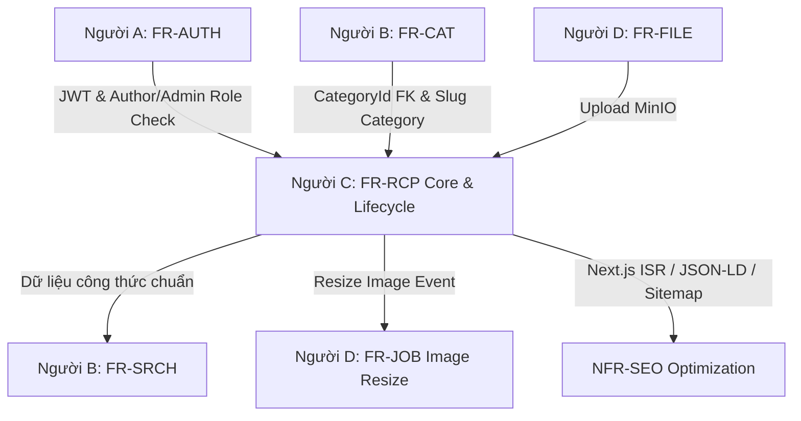
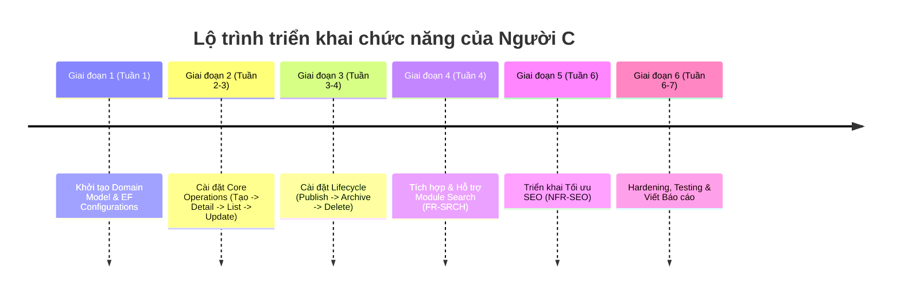

# BÁO CÁO PHÂN TÍCH VÀ KẾ HOẠCH TRIỂN KHAI CÔNG VIỆC CỦA NGUỜI C
**Dự án:** Culinary Blog — Nền tảng chia sẻ công thức nấu ăn (API-Driven Architecture)  
**Tài liệu tham chiếu:** `TEAM_ASSIGNMENT.md` & `SRS_Culinary_Blog_v1.0.0.md`  

---

## I. TỔNG QUAN VỀ PHÂN CÔNG CÔNG VIỆC (TEAM ASSIGNMENT)

Dựa trên nguyên tắc **Vertical Slice** (mỗi thành viên sở hữu trọn vẹn module từ Backend domain/CQRS/endpoint đến Frontend page/component/hook), **Người C** được giao nhiệm vụ cốt lõi quản lý phần "linh hồn" của hệ thống — **Công thức nấu ăn (Recipe Management)** và **Tối ưu chuẩn SEO**.

### 1. Các module & chức năng phụ trách chính

| Tuần thực hiện | Mã chức năng / Yêu cầu | Tên chức năng / Nội dung công việc | Vai trò | Phụ thuộc trước |
| :--- | :--- | :--- | :--- | :--- |
| **Tuần 1** | **Chapter 7** | Xây dựng Domain Entities & EF Configurations cho Recipe & các sub-entities | Phụ trách chính (cùng B, D) | Scaffold codebase |
| **Tuần 2–3** | **FR-RCP-001 → 004** | Core Recipe Operations (Tạo mới, Xem chi tiết, Xem danh sách, Cập nhật) | Phụ trách chính | FR-AUTH (JWT auth), FR-CAT (CategoryId) |
| **Tuần 3–4** | **FR-RCP-005 → 007** | Recipe Lifecycle (Publish/Unpublish, Archive, Xóa vĩnh viễn) | Phụ trách chính | FR-RCP-001 → 004 |
| **Tuần 4** | **FR-SRCH** | Hỗ trợ Người B làm chức năng Tìm kiếm (Full-text search, Filter, Sort) | Hỗ trợ | FR-RCP (cần có dữ liệu thật để test search) |
| **Tuần 6** | **NFR-SEO** | Tối ưu SEO (JSON-LD Schema.org, Meta/OG Tags, Sitemap, Slug Redirect) | Phụ trách chính (cùng B) | FR-RCP & FR-CAT hoàn thiện |
| **Tuần 6–7** | **Hardening** | Tối ưu hiệu năng, bảo mật (NFR-SEC, NFR-PERF), viết Unit/Integration Tests & Báo cáo đồ án | Cả 4 người | Tất cả các module |

### 2. Mối quan hệ phụ thuộc giữa Người C và các thành viên khác



- **Tiền đề bắt buộc:** Người C chỉ có thể gọi test API bảo vệ (Create/Update/Publish/Delete) khi **Người A** hoàn thành `FR-AUTH` (JWT authentication & Role-based authorization) và **Người B** hoàn thành `FR-CAT` (Danh mục bài viết).
- **Phối hợp phát triển:** Người C triển khai phần khung Recipe (FR-RCP-001 → 007). **Người D** triển khai phần quản lý ảnh minh họa chi tiết, nguyên liệu, các bước (FR-RCP-008 → 010) và lưu file MinIO.
- **Bàn giao dữ liệu:** Người C hoàn thành dữ liệu công thức thật để **Người B** tích hợp PostgreSQL Full-text Search (`tsvector`/`tsquery`) trong `FR-SRCH`.

---

## II. CHI TIẾT CÁC CHỨC NĂNG NGUỜI C PHỤ TRÁCH THEO SRS V1.0.0

### 1. Khởi tạo Domain Model & Database Mapping (Tuần 1)
- **Mô tả:** Định nghĩa các class Domain Entity kế thừa từ `BaseEntity`, tuân thủ rule Clean Architecture (không import bất kỳ NuGet bên ngoài BCL).
- **Cấu trúc Entities phụ trách:**
  - `Recipe` (Aggregate Root): `Id`, `Title`, `Slug`, `Description`, `CategoryId`, `AuthorId`, `PrepTimeMinutes`, `CookTimeMinutes`, `Servings`, `Difficulty` (Enum), `Status` (Enum: Draft, Published, Archived), `RowVersion` (`bytea` / `[Timestamp]`), `CreatedAt`, `UpdatedAt`, `IsDeleted`.
  - `RecipeNutrition` (Owned Entity): `Calories`, `Protein`, `Carbs`, `Fat` (lưu thành các cột trực tiếp trong bảng `recipes`).
  - Mapping quan hệ EF Core Configuration: 1 Recipe có nhiều `RecipeStep`, `RecipeIngredient`, `RecipeImage`. Thiết lập Foreign Keys, Index trên `Slug` (Unique) và `CategoryId`.

---

### 2. FR-RCP-003: Tạo Công thức Nấu ăn Mới [Author/Admin]
- **Mã yêu cầu:** `FR-RCP-003` | **Ưu tiên:** `Must Have` | **Tác nhân:** Author / Admin
- **Mô tả hoạt động:**
  - Tác giả hoặc Admin gửi request tạo mới công thức. Trạng thái ban đầu bắt buộc luôn là **Draft** (nháp).
  - Hệ thống tự động sinh `Slug` từ `Title` qua `SlugHelper.Generate(title)` (chữ thường, không dấu, gạch nối `-`). Slug phải đảm bảo tính **duy nhất**.
  - Cho phép đính kèm danh sách `Steps`, `Ingredients` và thông tin dinh dưỡng `Nutrition` ngay trong request tạo mới.
- **Luồng xử lý (Happy Path):**
  1. Client gửi `POST /api/v1/recipes` kèm JWT token header.
  2. Middleware kiểm tra authentication & role Author/Admin.
  3. `CreateRecipeCommand` được dispatch qua MediatR pipeline.
  4. `ValidationBehavior` kiểm tra dữ liệu đầu vào: Title (5–200 ký tự), prepTime/cookTime/servings > 0, categoryId hợp lệ.
  5. `Recipe.Create(...)` khởi tạo Entity.
  6. Thêm entity vào DB qua Repository/UnitOfWork, gọi `SaveChangesAsync()`.
  7. Invalidate Output Cache tag `"recipes"`.
  8. Trả về `HTTP 201 Created` kèm `RecipeDto` và header `Location`.
- **Luồng ngoại lệ:**
  - `401 Unauthorized` / `403 Forbidden`: Chưa đăng nhập hoặc không đúng role.
  - `409 Conflict`: Slug sinh ra bị trùng lặp.
  - `422 Unprocessable Entity`: CategoryId không tồn tại hoặc validation thất bại.
- **Endpoint:** `POST /api/v1/recipes`

---

### 3. FR-RCP-002: Xem Chi tiết Công thức
- **Mã yêu cầu:** `FR-RCP-002` | **Ưu tiên:** `Must Have` | **Tác nhân:** Tất cả (Guest / Author / Admin)
- **Mô tả hoạt động:**
  - Truy xuất toàn bộ thông tin chi tiết của bài viết công thức dựa trên `slug` URL.
  - Tự động nạp (Eager Loading) tất cả các thực thể con: danh sách nguyên liệu (sắp xếp theo `SortOrder`), các bước thực hiện (sắp xếp theo `StepNumber`), hình ảnh, thông tin dinh dưỡng, danh mục và tác giả.
  - Kiểm tra quyền riêng tư: Nếu công thức đang ở trạng thái **Draft** hoặc **Archived**, chỉ **Tác giả sở hữu** (`AuthorId == currentUserId`) hoặc **Admin** mới được phép xem. Guest và Author khác sẽ bị chặn.
- **Luồng xử lý (Happy Path):**
  1. Client gửi `GET /api/v1/recipes/{slug}`.
  2. `GetRecipeBySlugQuery` dispatch qua MediatR.
  3. Handler thực hiện LINQ query `Include(Steps).Include(Ingredients).Include(Images).Include(Category).Include(Author).IncludeOwned(Nutrition)`.
  4. Kiểm tra quyền truy cập trạng thái Draft/Archived.
  5. Map entity sang `RecipeDetailDto`.
  6. Lưu Output Cache policy `"RecipeDetail"` (TTL 60 phút), tag `["recipes", $"recipe:{slug}"]`.
  7. Trả về `HTTP 200 OK`.
- **Luồng ngoại lệ:**
  - `404 Not Found`: Slug không tồn tại trong hệ thống.
  - `403 Forbidden`: Truy cập công thức Draft của người khác khi không phải Admin.
- **Endpoint:** `GET /api/v1/recipes/{slug}`

---

### 4. FR-RCP-001: Xem Danh sách Công thức (Paginated + Filtered + Sorted)
- **Mã yêu cầu:** `FR-RCP-001` | **Ưu tiên:** `Must Have` | **Tác nhân:** Tất cả (Guest / Author / Admin)
- **Mô tả hoạt động:**
  - Trả về danh sách công thức hỗ trợ **Phân trang (Offset Pagination)**, **Lọc (Filter)** theo danh mục (`categoryId`), độ khó (`difficulty`), thời gian nấu tối đa (`maxCookTime`), và **Sắp xếp (Sort)** theo ngày tạo, tiêu đề, thời gian nấu.
  - Lọc theo quyền hạn:
    - **Guest / Author khác:** Chỉ thấy bài viết `Status == Published`.
    - **Author đăng nhập:** Thấy bài viết `Published` + bài viết `Draft`/`Archived` của **chính mình**.
    - **Admin:** Thấy tất cả các công thức trong hệ thống.
- **Luồng xử lý (Happy Path):**
  1. Client gửi `GET /api/v1/recipes?page=1&pageSize=12&categoryId={guid}&difficulty=Easy&maxCookTime=30&sort=-createdAt`.
  2. `GetRecipesQuery` dispatch qua MediatR.
  3. Handler dựng `IQueryable` áp dụng các điều kiện lọc và phân quyền.
  4. Thực hiện `COUNT` tổng số bản ghi thỏa điều kiện.
  5. Áp dụng `SKIP ((page-1)*pageSize)` và `TAKE pageSize`.
  6. Map sang `PagedResult<RecipeSummaryDto>`.
  7. Output Cache lưu kết quả policy `"RecipeList"` (TTL 15 phút, vary by query string). Trả về `HTTP 200 OK`.
- **Luồng ngoại lệ:**
  - `422 Unprocessable Entity`: `page < 1` hoặc `pageSize` ngoài khoảng `[1, 50]`.
- **Endpoint:** `GET /api/v1/recipes?page={n}&pageSize={n}&categoryId={guid}&difficulty={level}&maxCookTime={min}&sort={field}`

---

### 5. FR-RCP-004: Cập nhật Công thức [Author-Owner/Admin]
- **Mã yêu cầu:** `FR-RCP-004` | **Ưu tiên:** `Must Have` | **Tác nhân:** Tác giả sở hữu / Admin
- **Mô tả hoạt động:**
  - Cho phép chỉnh sửa thông tin cơ bản của công thức (tiêu đề, mô tả, danh mục, khẩu phần, thời gian, dinh dưỡng...).
  - **Resource-Based Authorization:** Chỉ người tạo ra bài viết (`AuthorId == currentUserId`) hoặc Admin mới có quyền cập nhật.
  - **Optimistic Concurrency Control:** Sử dụng trường `RowVersion` (`bytea`). Client gửi `RowVersion` hiện tại qua header `If-Match` hoặc body request. Nếu dữ liệu trên DB đã bị sửa bởi request khác, EF Core ném `DbUpdateConcurrencyException` → Trả về lỗi Conflict `HTTP 409`.
- **Luồng xử lý (Happy Path):**
  1. Client gửi `PUT /api/v1/recipes/{id:guid}` kèm body và `If-Match` header.
  2. `UpdateRecipeCommand` dispatch qua MediatR.
  3. Kiểm tra Resource-Based Authorization (`IAuthorizationService`).
  4. Đọc Entity từ DB, gọi domain method `recipe.Update(...)`.
  5. `SaveChangesAsync()` — kiểm tra xung đột `RowVersion`.
  6. Invalidate Output Cache tags `"recipes"` và `$"recipe:{slug}"`.
  7. Trả về `HTTP 200 OK` kèm `RecipeDto` cập nhật.
- **Luồng ngoại lệ:**
  - `403 Forbidden`: Người dùng không phải tác giả sở hữu hoặc Admin.
  - `404 Not Found`: ID công thức không tồn tại.
  - `409 Conflict`: Dữ liệu bị thay đổi bởi người khác (RowVersion mismatch).
- **Endpoint:** `PUT /api/v1/recipes/{id:guid}`

---

### 6. FR-RCP-005: Xuất bản / Hủy Xuất bản Công thức (Publish / Unpublish)
- **Mã yêu cầu:** `FR-RCP-005` | **Ưu tiên:** `Must Have` | **Tác nhân:** Tác giả sở hữu / Admin
- **Mô tả hoạt động:**
  - Chuyển trạng thái công thức từ `Draft` → `Published` (công khai) hoặc `Published` → `Draft` (ẩn tạm thời).
  - **Ràng buộc nghiệp vụ bắt buộc (Business Rule):** Không cho phép Publish nếu công thức chưa có ít nhất **1 bước thực hiện** (`Steps.Count > 0`). Nếu vi phạm, Domain Model ném `DomainException` → Trả về `HTTP 422`.
- **Luồng xử lý (Happy Path):**
  1. Client gửi `PATCH /api/v1/recipes/{id:guid}/publish` hoặc `/unpublish`.
  2. `PublishRecipeCommand` dispatch.
  3. Kiểm tra Resource-Based Authorization.
  4. Gọi domain method `recipe.Publish()` (hoặc `recipe.Unpublish()`).
  5. `recipe.Publish()` kiểm tra `Steps.Count == 0` → Throw `DomainException`.
  6. Cập nhật `Status = Published`, `UpdatedAt = DateTime.UtcNow`.
  7. `SaveChangesAsync()`, invalidate cache tags. Trả về `HTTP 200 OK`.
- **Luồng ngoại lệ:**
  - `422 Unprocessable Entity`: Công thức chưa có bước thực hiện nào.
  - `403 Forbidden` / `404 Not Found`.
- **Endpoint:** `PATCH /api/v1/recipes/{id:guid}/publish` | `PATCH /api/v1/recipes/{id:guid}/unpublish`

---

### 7. FR-RCP-006: Lưu trữ Công thức (Archive / Unarchive)
- **Mã yêu cầu:** `FR-RCP-006` | **Ưu tiên:** `Should Have` | **Tác nhân:** Tác giả sở hữu / Admin
- **Mô tả hoạt động:**
  - Chuyển bài viết sang trạng thái `Archived`. Bài viết Archived sẽ không xuất hiện trong danh sách tìm kiếm/công khai nhưng dữ liệu vẫn được bảo tồn trong DB (soft hide).
- **Endpoint:** `PATCH /api/v1/recipes/{id:guid}/archive`
- **Kết quả:** Trả về `HTTP 200 OK` khi lưu trữ thành công.

---

### 8. FR-RCP-007: Xóa Vĩnh viễn Công thức [Author-Owner/Admin]
- **Mã yêu cầu:** `FR-RCP-007` | **Ưu tiên:** `Must Have` | **Tác nhân:** Tác giả sở hữu / Admin
- **Mô tả hoạt động:**
  - Xóa vĩnh viễn (Hard Delete) bản ghi công thức và tự động xóa lan truyền (Cascade Delete) các entity con (`RecipeStep`, `RecipeIngredient`, `RecipeImage`) trong PostgreSQL.
  - **Xử lý bất đồng bộ file vật lý:** Các file ảnh đính kèm trên MinIO S3 được đưa vào hàng đợi Hangfire Background Job (`BackgroundJob.Enqueue<IFileStorageService>(...)`) để xóa ngầm, tránh gây treo HTTP request của người dùng.
- **Luồng xử lý (Happy Path):**
  1. Client gửi `DELETE /api/v1/recipes/{id:guid}`.
  2. `DeleteRecipeCommand` dispatch qua MediatR.
  3. Kiểm tra Resource-Based Authorization.
  4. Lấy danh sách `ImageUrl` từ các `RecipeImage`.
  5. Gọi `_unitOfWork.Recipes.Remove(recipe)` và `SaveChangesAsync()`.
  6. Enqueue Hangfire jobs xóa các file ảnh trên MinIO bất đồng bộ.
  7. Invalidate cache tags `"recipes"` và `$"recipe:{recipe.Slug}"`.
  8. Trả về `HTTP 204 No Content`.
- **Endpoint:** `DELETE /api/v1/recipes/{id:guid}`

---

### 9. NFR-SEO: Tối ưu Hóa Động cơ Tìm kiếm (SEO Optimization) (Tuần 6)
- **Mã yêu cầu:** `NFR-SEO-001` → `NFR-SEO-004` | **Ưu tiên:** `High`
- **Nội dung chi tiết:**
  1. **NFR-SEO-001 (Structured Data JSON-LD Schema.org):**  
     Tại Next.js Frontend (SSR Page `/recipes/[slug]`), tự động tạo thẻ `<script type="application/ld+json">` chứa dữ liệu cấu trúc chuẩn Schema.org `Recipe` (`@type: "Recipe"`, `name`, `description`, `image`, `author`, `datePublished`, `prepTime`, `cookTime`, `recipeIngredient[]`, `recipeInstructions[]`, `nutrition`). Đảm bảo pass 100% trên **Google Rich Results Test**.
  2. **NFR-SEO-002 (Meta Tags & Open Graph Protocol):**  
     Tự động tạo thẻ `<title>` (≤ 60 ký tự), `<meta name="description">` (150–160 ký tự), các thẻ Open Graph (`og:title`, `og:description`, `og:image` kích thước 1200×630px, `og:url`), Twitter Card (`summary_large_image`), Canonical URL chuẩn. Thẻ `robots`: `index, follow` cho Published và `noindex` cho Draft/Archived.
  3. **NFR-SEO-003 (Sitemap.xml & Robots.txt):**  
     Phối hợp với Người D (Job `FR-JOB-003`) xuất file `sitemap.xml` chứa toàn bộ đường dẫn recipe/category published và cài đặt `robots.txt` cho phép các Bot Google/Bing cào dữ liệu.
  4. **NFR-SEO-004 (URL Structure & Slug Redirect):**  
     Đảm bảo URL sạch dạng `/recipes/{slug}`. Nếu slug thay đổi ở bản nháp, cài đặt cơ chế HTTP 301 Permanent Redirect từ slug cũ sang slug mới.

---

## III. BẢNG TỔNG HỢP HTTP API ENDPOINTS CỦA NGUỜI C

| STT | Mã FR | HTTP Method | Route Endpoint | Quyền hạn (Authorization) | Response thành công |
| :--- | :--- | :--- | :--- | :--- | :--- |
| 1 | FR-RCP-003 | `POST` | `/api/v1/recipes` | Author / Admin | `201 Created` (`RecipeDto`) |
| 2 | FR-RCP-002 | `GET` | `/api/v1/recipes/{slug}` | Public (Guest/Author/Admin)* | `200 OK` (`RecipeDetailDto`) |
| 3 | FR-RCP-001 | `GET` | `/api/v1/recipes` | Public (Guest/Author/Admin)* | `200 OK` (`PagedResult<RecipeSummaryDto>`) |
| 4 | FR-RCP-004 | `PUT` | `/api/v1/recipes/{id:guid}` | Author-Owner / Admin | `200 OK` (`RecipeDto`) |
| 5 | FR-RCP-005 | `PATCH` | `/api/v1/recipes/{id:guid}/publish` | Author-Owner / Admin | `200 OK` (`RecipeDto`) |
| 6 | FR-RCP-005 | `PATCH` | `/api/v1/recipes/{id:guid}/unpublish` | Author-Owner / Admin | `200 OK` (`RecipeDto`) |
| 7 | FR-RCP-006 | `PATCH` | `/api/v1/recipes/{id:guid}/archive` | Author-Owner / Admin | `200 OK` (`RecipeDto`) |
| 8 | FR-RCP-007 | `DELETE` | `/api/v1/recipes/{id:guid}` | Author-Owner / Admin | `204 No Content` |

*\* Ghi chú: Endpoint Public nhưng có xử lý phân quyền bên trong theo trạng thái bài viết.*

---

## IV. SẮP XẾP THỨ TỰ THỰC HIỆN LOGIC (IMPLEMENTATION ROADMAP)

Để tối ưu tiến độ, giảm bế tắc (blockers) và tuân thủ nguyên tắc kế thừa dữ liệu, các chức năng được sắp xếp làm theo 6 giai đoạn sau:



### Lý do chi tiết cho thứ tự thực hiện:

1. **Giai đoạn 1 — Tuần 1: Domain Entities & Database Mapping (`Domain & EF Configs`)**
   - *Lý do:* Phải có class Entity (`Recipe`, `RecipeNutrition`, `RecipeStep`, `RecipeIngredient`, `RecipeImage`) và EF Core Configurations trước thì mới có thể tạo DB Migration và viết được các Command/Query.

2. **Giai đoạn 2 — Tuần 2-3: Core Operations (`FR-RCP-003` → `FR-RCP-002` → `FR-RCP-001` → `FR-RCP-004`)**
   - **Bước 2.1 — FR-RCP-003 (Create Recipe):** Phải làm chức năng **Tạo mới** đầu tiên để có dữ liệu thử nghiệm trong DB.
   - **Bước 2.2 — FR-RCP-002 (Get Recipe Detail):** Làm tiếp chức năng Xem chi tiết để kiểm tra xem dữ liệu vừa tạo ra có nạp đúng các quan hệ (Eager Loading) hay không.
   - **Bước 2.3 — FR-RCP-001 (Get Recipes List):** Tiếp tục xây dựng trang danh sách, phân trang, lọc và sắp xếp.
   - **Bước 2.4 — FR-RCP-004 (Update Recipe):** Hoàn thiện tính năng chỉnh sửa và cài đặt Optimistic Concurrency Control qua `RowVersion`.

3. **Giai đoạn 3 — Tuần 3-4: Recipe Lifecycle (`FR-RCP-005` → `FR-RCP-006` → `FR-RCP-007`)**
   - **Bước 3.1 — FR-RCP-005 (Publish/Unpublish):** Kiểm tra điều kiện bắt buộc `Steps.Count > 0` trước khi chuyển trạng thái bài viết sang Published.
   - **Bước 3.2 — FR-RCP-006 (Archive Recipe):** Cài đặt chuyển trạng thái lưu trữ mềm.
   - **Bước 3.3 — FR-RCP-007 (Delete Recipe):** Xóa vĩnh viễn dữ liệu DB và tích hợp Hangfire Background Job xóa ảnh MinIO.

4. **Giai đoạn 4 — Tuần 4: Hỗ trợ Module Search (`FR-SRCH`)**
   - Phối hợp với Người B kiểm thử tính năng tìm kiếm Full-text search trên PostgreSQL dữ liệu Recipe đã tạo ra.

5. **Giai đoạn 5 — Tuần 6: Tối ưu SEO (`NFR-SEO-001 → 004`)**
   - Triển khai SSR/ISR Metadata, JSON-LD Rich Snippet Schema.org, Open Graph trên Frontend Next.js khi giao diện và API đã ổn định.

6. **Giai đoạn 6 — Tuần 6-7: Hardening, Integration Test & Documentation**
   - Viết Unit Tests cho Handlers, Integration Tests cho Endpoints, rà soát hiệu năng (Output Cache) và viết báo cáo đồ án.

---

## V. QUY ĐỊNH QUẢN LÝ MÃ NGUỒN (GIT BRANCH & COMMIT STRATEGY)

Để làm việc song song 4 người không bị xung đột code (conflict), dự án quy ước chuẩn đặt tên nhánh và nội dung commit như sau:

### 1. Quy ước tên nhánh (Git Branching Rule)
- **Cấu trúc bắt buộc:** `mssv/ten/chuc-nang`  
  *(Ví dụ giả định MSSV: `2312691`, Tên: `NguyenThanhMinh`)*

### 2. Danh sách các nhánh tương ứng từng chức năng của Người C:

| STT | Chức năng / Task | Tên nhánh đề xuất (Branch Name) |
| :--- | :--- | :--- |
| 1 | Domain Entities & EF Configs | `2312691/NguyenThanhMinh/domain-recipe-entities` |
| 2 | FR-RCP-003: Tạo công thức nấu ăn | `2312691/NguyenThanhMinh/fr-rcp-003-create-recipe` |
| 3 | FR-RCP-002: Xem chi tiết công thức | `2312691/NguyenThanhMinh/fr-rcp-002-get-recipe-detail` |
| 4 | FR-RCP-001: Xem danh sách công thức | `2312691/NguyenThanhMinh/fr-rcp-001-get-recipes-list` |
| 5 | FR-RCP-004: Cập nhật công thức | `2312691/NguyenThanhMinh/fr-rcp-004-update-recipe` |
| 6 | FR-RCP-005: Xuất bản / Hủy xuất bản | `2312691/NguyenThanhMinh/fr-rcp-005-publish-recipe` |
| 7 | FR-RCP-006: Lưu trữ công thức | `2312691/NguyenThanhMinh/fr-rcp-006-archive-recipe` |
| 8 | FR-RCP-007: Xóa vĩnh viễn công thức | `2312691/NguyenThanhMinh/fr-rcp-007-delete-recipe` |
| 9 | Hỗ trợ Tìm kiếm FR-SRCH | `2312691/NguyenThanhMinh/support-fr-srch-search-integration` |
| 10 | NFR-SEO: Tối ưu SEO & Schema.org | `2312691/NguyenThanhMinh/nfr-seo-optimization` |
| 11 | Hardening, Tests & Docs | `2312691/NguyenThanhMinh/hardening-testing-docs` |

### 3. Quy tắc viết Commit Message
- **Nội dung commit:** Bắt buộc viết bằng **Tiếng Việt**, rõ nghĩa.
- **Định dạng khuyến nghị (Conventional Commits Tiếng Việt):**
  - `feat(recipe): <nội dung tiếng Việt>` — Thêm chức năng mới.
  - `fix(recipe): <nội dung tiếng Việt>` — Sửa lỗi.
  - `test(recipe): <nội dung tiếng Việt>` — Viết unit test / integration test.
  - `docs(recipe): <nội dung tiếng Việt>` — Cập nhật tài liệu.

#### Mẫu Commit Messages ví dụ cho Người C:
```bash
# Nhánh Domain:
git commit -m "feat(recipe): khởi tạo domain entity Recipe, RecipeNutrition và EF Core configurations"

# Nhánh FR-RCP-003:
git commit -m "feat(recipe): cài đặt CreateRecipeCommand và ValidationBehavior cho FR-RCP-003"
git commit -m "feat(recipe): bổ sung endpoint POST /api/v1/recipes tạo công thức nháp"

# Nhánh FR-RCP-002:
git commit -m "feat(recipe): cài đặt GetRecipeBySlugQuery hỗ trợ Eager Loading và Output Cache"

# Nhánh FR-RCP-004:
git commit -m "feat(recipe): xử lý kiểm tra RowVersion chống xung đột dữ liệu trong UpdateRecipeCommand"

# Nhánh FR-RCP-005:
git commit -m "feat(recipe): cài đặt logic bắt buộc phải có ít nhất 1 bước thực hiện trước khi Publish"

# Nhánh FR-RCP-007:
git commit -m "feat(recipe): tích hợp Hangfire Background Job xóa file ảnh trên MinIO bất đồng bộ khi xóa recipe"

# Nhánh NFR-SEO:
git commit -m "feat(seo): cấu hình JSON-LD Schema.org Recipe và thẻ Open Graph cho Next.js App Router"
```

---

## VI. CHECKLIST TIÊU CHUẨN NGHIỆM THU (DEFINITION OF DONE)

Mỗi Pull Request (PR) do **Người C** tạo ra trước khi merge vào nhánh chính `main`/`develop` phải thỏa mãn 6 điều kiện sau (theo `CLAUDE.md` Section 5):

- [x] **Build xanh:** Lệnh `dotnet build` chạy không có lỗi và không phát sinh warning mới.
- [x] **Test đầy đủ:** Đã viết Unit Test cho Handler mới (thỏa mãn Happy Path + ít nhất 1 lỗi nghiệp vụ).
- [x] **Integration Test:** Đã viết Integration Test gọi qua HTTP Endpoint thật đối với Command/Query có expose API.
- [x] **Clean Architecture:** Không vi phạm Dependency Rule (Domain KHÔNG import NuGet ngoài BCL; Application chỉ import Domain).
- [x] **PR Mô tả chuẩn:** Mô tả PR ghi rõ các mã FR/CONS đã hoàn thành (Ví dụ: *"Thỏa FR-RCP-003, CONS-002, CONS-008"*).
- [x] **Phạm vi file:** Chỉ chỉnh sửa các file thuộc module Recipe & SEO được phân công trong `TEAM_ASSIGNMENT.md` để tránh conflict.

---

## VII. KẾT LUẬN & HƯỚNG DẪN BẮT ĐẦU

Người C đóng vai trò rất quan trọng trong dự án Culinary Blog. Để bắt đầu công việc ngay lập tức:
1. Đảm bảo Người A và Người B đã sẵn sàng các định nghĩa cơ bản về Identity/JWT và Danh mục.
2. Rẽ nhánh git đầu tiên: `git checkout -b 2312691/NguyenThanhMinh/domain-recipe-entities`.
3. Xây dựng bộ Domain Entity & EF Core Configuration chuẩn xác theo Chương 7 của SRS v1.0.0.
4. Tiến hành xây dựng các feature CQRS bằng MediatR theo từng nhánh tương ứng với lộ trình đã lập.
